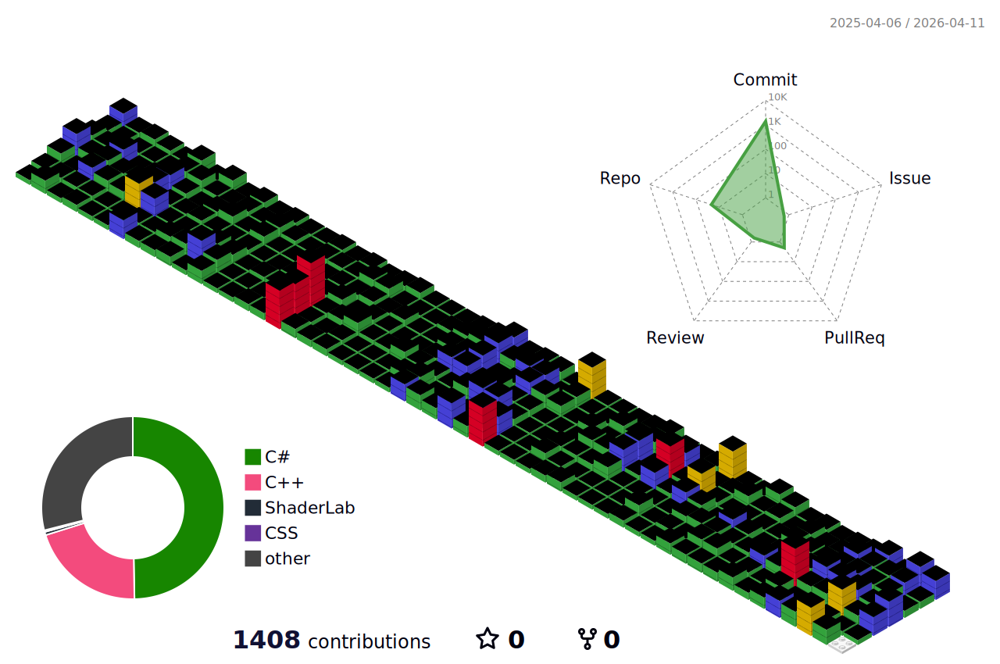

# 저를 소개합니다 
> -게임 개발자를 꿈꾸는 학생입니다 
-C#을 열심히 공부하고 있습니다 
-SUSOT이라는 이름은 제 유튜브 채널 이름입니다 

# 🎞티스토리 

 
 Tistroy를 누르면 링크가 열려요

# 📚공부중인 언어 

 

# 🛠공부중인 툴 

 

 

# 🏆경력🏆
### 2024년 
1학기 
#### 🎉1학년 1학기 엔진 개인프로젝트 우수작 선정 
#### 🏅1학년 하계 게임잼 5등상 수상 
#### 🎮개인 프로젝트 3개 제작   

2학기 
#### 🎉교내 수학게임 공모전 장려상 수상 
#### 🎖️1학년 2학기 엔진 팀프로젝트 7등 
#### 🏆전공동아리 프로젝트 우수상 수상(최종 2등) 
#### 🎮1학년 동계 게임잼 참가   

### 2025년 
1학기 
#### 🥉만들래 10분 게임 콘테스트 방치편 최종 3등(장려상 수상) 

2학기 

# 🗣깃허브 정보 

 

 
 

 

# 📈백준 정보 

 

   

