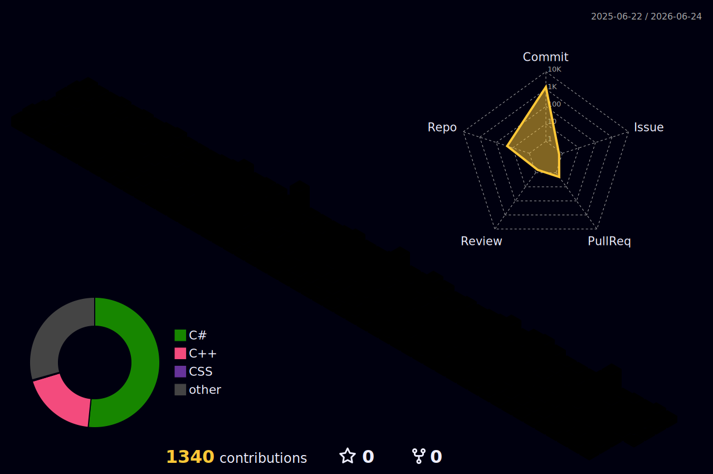

  

  

  
  
  

  

## 👋 About
- 게임 개발자를 꿈꾸는 학생입니다.
- Unity(C#) 중심으로 프로젝트를 만들고, 알고리즘/CS도 함께 공부하고 있습니다.
- **SUSOT**은 제 유튜브 채널/활동명입니다.

---

## 🧩 Skills

  

---

## 🏆 Awards & Activities

  
<b>2024</b>

  - **1학기**
    - 1학년 1학기 엔진 개인프로젝트 **우수작 선정**
    - 1학년 하계 게임잼 **5등상 수상**
    - 개인 프로젝트 3개 제작
  - **2학기**
    - 교내 수학게임 공모전 **장려상 수상**
    - 1학년 2학기 엔진 팀프로젝트 **7등**
    - 전공동아리 프로젝트 **우수상 수상(최종 2등)**
    - 1학년 동계 게임잼 참가

---

## 📈 GitHub

  

---

## 🌿 3D Contribution

  

---

## 🧠 Algorithm (BOJ)

  
  

  

  <b>Thank You</b> 
  SUSOT

